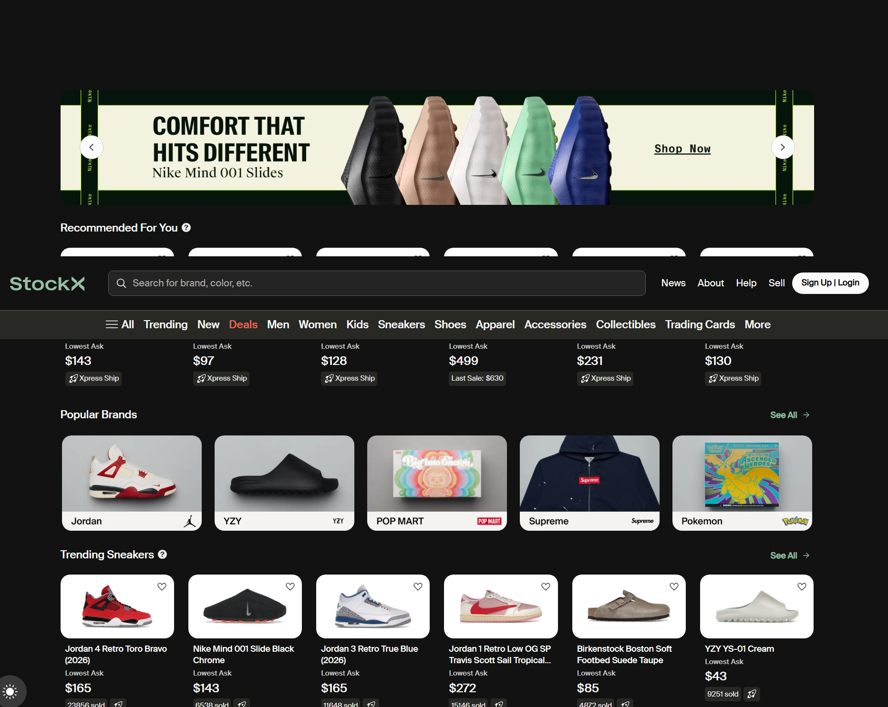
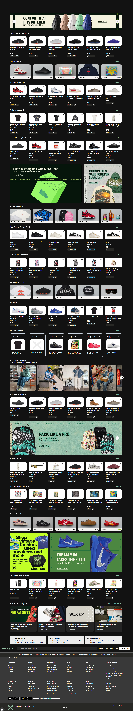

|Section          |Field           |Answer                                         |
|-----------------|----------------|-----------------------------------------------|
|Business Identity|Trading Name    |Weardon                                        |
|                 |Year Established|2023                                           |
|Contact          |Primary Contact |Alexander Afake, CEO                           |
|                 |Phone / WhatsApp|233556008189                                   |
|                 |Email           |[weadon70@gmail.com](mailto:weadon70@gmail.com)|
|                 |City / Country  |Ghana                                          |
|Domain           |Preferred Domain|weardon.com                                    |
|                 |Owns domain?    |No                                             |
|Social           |Facebook        |Wear Don                                       |
|                 |Instagram       |weardon70                                      |
|Brand Assets     |Has logo?       |Yes — will supply                              |
|Products         |Main product    |Unisex slippers                                |
|                 |Delivery        |Nationwide and international                   |

|Layer                       |Technology                                       |Source                                                                                      |
|----------------------------|-------------------------------------------------|--------------------------------------------------------------------------------------------|
|Frontend                    |React + Redux (“Universal React/Redux front end”)|[Farfetch job listing](https://startup.jobs/software-engineer-full-stack-farfetch-2-2489373)|
|Frontend (confirmed current)|“Modern, React-based technology stack”           |[Built In job listing](https://builtin.com/job/software-engineer-front-end/3696025)         |
|Backend                     |.NET Core / ASP.NET Core                         |Same Farfetch job listing above                                                             |
|Live site scan              |ASP.NET, JavaScript, Akamai CDN, HTTP/2          |[W3Techs](https://w3techs.com/sites/info/farfetch.com)                                      |
|Open source tooling         |Apache Kafka, custom .NET libraries              |[Farfetch GitHub](https://github.com/farfetch)      

One thing to note: Firebase Authentication doesn't have to be your entire user-management system. A common setup is Firebase handling authentication while ASP.NET Core validates the user's identity/token and handles the application's actual business logic and database operations.

FOR MY CORE BACKEND I WILL USE CLOUDINARY FOR STORAGE, FIREBASE FOR AUTHENTICATION.                                        |

some brand inspiration, i like the layout and the way they showcase their products. 

kente related color but just smaller part of the web
